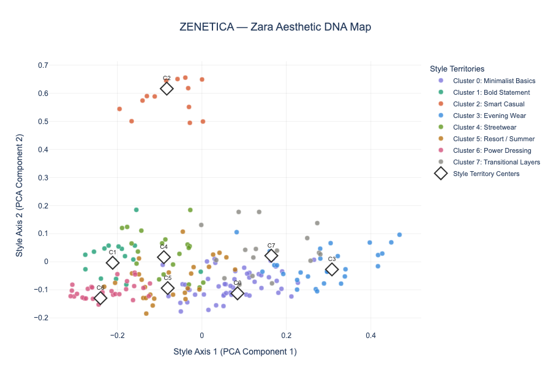
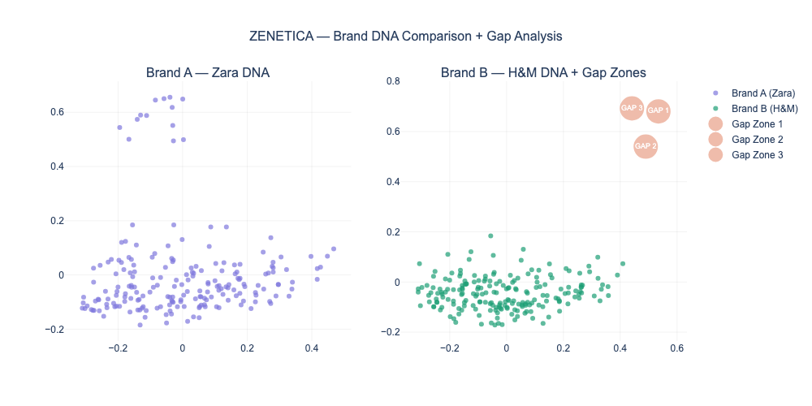

# ZENETICA 🧬
### AI-Powered Brand Intelligence Platform for Fashion

> "The brand's brain. Built with AI."

ZENETICA is a Gen AI + ML system that reads a fashion brand's entire 
catalog, builds its Aesthetic DNA fingerprint, detects style gaps 
competitors own, scans live cultural signals, and generates a 
next-season creative brief — complete with AI-generated moodboard.

**Built for:** Fashion brands making billion-dollar design decisions on gut feel.

---

## The Problem

Fashion brands manage 10,000–500,000 SKUs but make collection decisions 
using spreadsheets and agency trend decks. By the time a collection 
launches, the cultural moment has moved on.

- 🚨 **84.6%** cart abandonment in fashion — highest of any industry
- 🚨 **30-40%** excess inventory industry-wide from bad design decisions  
- 🚨 **$500B** lost annually in unsold stock
- 🚨 **Zero tools** exist that audit a brand's own aesthetic identity

**ZENETICA solves this.**

---

## What It Does

| Module | Technology | Output |
|--------|-----------|--------|
| 🧬 Aesthetic DNA Engine | CLIP ViT-B/32 + K-Means + PCA | Interactive brand style map |
| 🔍 Gap Detector | KDE + FAISS + GPT-4o + RAG | Competitor white-space report |
| 📡 Trend Scanner | CLIP text encoding + LSTM | On-brand vs off-brand scores |
| 📝 Collection Brief | RAG + GPT-4o | Next-season creative strategy |
| 🎨 Moodboard Generator | DALL-E 3 | Brand-conditioned visual brief |

---

## Day 1 Output — Brand Aesthetic DNA Map

Every dot = one fashion item encoded by CLIP.  
Every color = one style territory discovered automatically by K-Means.  
Zero human labels. Pure ML.



---

## Day 2 Output — Gap Analysis + Competitor Intelligence

Red zones = style territories Brand A doesn't own but Brand B does.  
Found using KDE density estimation + FAISS vector search.



### AI-Generated Gap Intelligence Report (GPT-4o + RAG)
```
ZENETICA Gap Intelligence Report — Zara

Gap Zone 1: Urban Casual Essentials
Missing: Diverse casualwear combining comfort with style
Competitor owns it: H&M dominates with accessible stylish basics
Action: Introduce elevated basics — relaxed denim, graphic tees, knitwear

Gap Zone 2: Sophisticated Evening Wear  
Missing: Affordable luxury eveningwear
Competitor owns it: H&M offers affordable yet sophisticated options
Action: Capsule eveningwear collection — sleek silhouettes, rich palettes

Gap Zone 3: Eco-Conscious Streetwear
Missing: Sustainable streetwear for younger demographics
Competitor owns it: H&M's accessible streetwear with sustainability angle
Action: Sustainable streetwear line — eco fabrics, limited editions

Strategic Priority: Gap Zone 2 (Sophisticated Evening Wear)
Highest revenue potential during peak social seasons.
```

---

## Tech Stack
```
CLIP (ViT-B/32)      Vision Transformer — 400M params — image embeddings
K-Means + PCA        Unsupervised style territory discovery
KDE (scipy)          Kernel Density Estimation — gap detection
FAISS (Meta)         Dense vector search — competitor analysis  
ChromaDB             Vector database — RAG knowledge base
GPT-4o               Creative brief + gap report generation
DALL-E 3             Moodboard image generation
LSTM (PyTorch)       Trend velocity forecasting
Gradio               Interactive demo interface
```

---

## Project Structure
```
ZENTICA-FashionBrain/
├── day1_dna_engine.py       # CLIP embeddings + DNA map
├── day2_gap_detector.py     # Gap detection + RAG report
├── day3_trend_brief.py      # Trend scanner + collection brief  
├── day4_app.py              # Full Gradio demo (coming Day 4)
├── models/                  # Saved embeddings (git-ignored)
├── outputs/
│   ├── zenetica_dna_map.html        # Interactive DNA map
│   ├── zenetica_dna_map.png         # DNA map screenshot
│   ├── zenetica_gap_analysis.html   # Interactive gap map
│   ├── zenetica_gap_analysis.png    # Gap analysis screenshot
│   └── zenetica_gap_report.md       # AI-generated gap report
├── requirements.txt
└── .env.example
```

---

## Setup
```bash
# 1. Clone
git clone https://github.com/hannahferns5/ZENTICA-FashionBrain.git
cd ZENTICA-FashionBrain

# 2. Create environment
conda create -n zenetica python=3.11 -y
conda activate zenetica
conda install pytorch torchvision -c pytorch -y

# 3. Install dependencies
pip install -r requirements.txt

# 4. Configure environment
cp .env.example .env
# Add your HF_TOKEN and OPENAI_API_KEY to .env

# 5. Run
python day1_dna_engine.py
python day2_gap_detector.py
```

---

## Progress

- [x] Day 1 — Aesthetic DNA Engine ✅
- [x] Day 2 — Gap Detector + RAG Intelligence ✅
- [ ] Day 3 — Trend Scanner + Collection Brief + Moodboard
- [ ] Day 4 — Gradio Demo + HuggingFace Spaces Deploy

---

## Built by
**Hannah Fernandes** — ML Student | Fashion × AI   
 